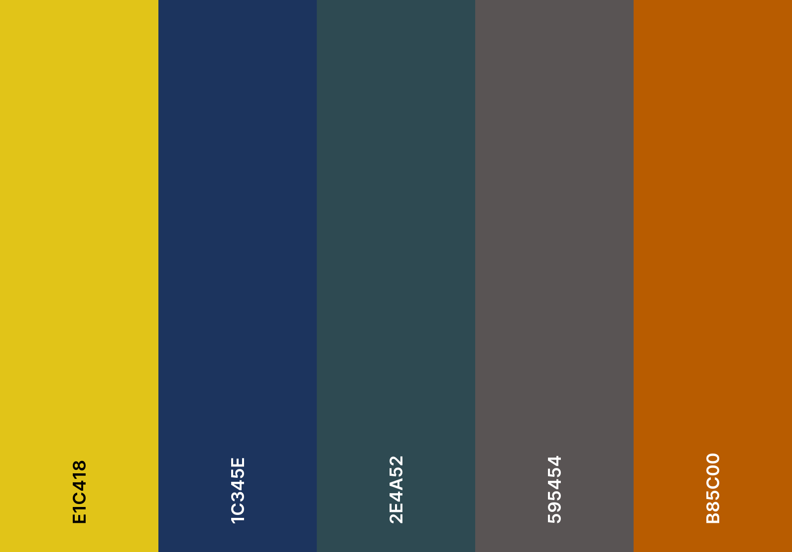

# Adopt-a-Dog Ireland
The Adopt-a-Dog Ireland website was designed to allows the user to Adopt-a-Dog from a dog shelter in Ireland.

[Adopt-a-Dog Ireland Website](https://garydolan.github.io/ci-p1-adopt-a-dog-ireland/)

# Table of Contents
1. [Introduction](#adopt-a-dog-ireland)
2. [User Experience](#user-experience)
    * [Initial Discussion](#initial-discussion)
    * [User stories](#user-stories)
3. [Design](#design)
    * [Colour scheme](#colour-scheme)
    * [Typography](#typography)
    * [Icon creation](#icon-creation)
    * [Imagery](#imagery)
    * [Wireframes](#wireframes)
4. [Features](#features)
    * [Future implementations](#future-implementations)
    * [Accessibility](#accessibility)
5. [Technologies used](#technologies-used)
    * [Languages](#languages)
    * [Version control](#version-control)
    * [Programs](#programs)
    * [Tools](#tools)
6. [Deployment & Local Deployment](#deployment--local-deployment)
    * [Deployment](#deployment)
    * [Local Deployment](#local-deployment)
        * [How to Fork](#how-to-fork)
        * [How to Clone](#how-to-clone)
7. [Testing](#testing)
    * [Automated testing](#automated-testing)
    * [Manual testiing](#manual-testiing)
    * [Bugs](#bugs)
8. [Design & Development issues](#design--development-issues)
    * [Index page](#index-page)
    * [Dog profile page](#dog-profile-page)
    * [About us page](#about-us-page)
9. [Credits](#credits)
    * [Copy](#copy)
    * [Acknowledgements](#acknowledgements)

# User Experience

## Initial Discussion
Adopt-a-Dog Ireland is a website that I (Gary Dolan) developed for my first project as part of Code Institutes Diploma in Full Stack Software Development. The websites target audience is people interested in adopting a dog in Ireland. It was designed to allow prospective dog adopters to browser a catalogue of adoptable dogs. The website will provide the user with all the adoptable dogs details and also guide the user through the adoption process. It will allow the user to apply to adopt a dog of their choice.

## User stories

### Owner / Client goals
* To ensure the user can easily and intuitively use and navigate the website.
* To create a website that encourages first time learning, keeping consistant navigation, coloring and imagery site wide.
* To create a website that promotes feelings of positivity and trust in the user, using coloring, imagery and light hearted and informal text.
* To allow users to browse a catalogue of dogs available for adoption at the shelter. 
* To ensure the processes & steps involved in dog adoption are conveyed clearly to the user.
* To make it easy and straightforward for the user to apply to adopt a dog.
* To create a website which is viewable on a large array of devices.
* To instill a sense of family values in the website to bolster a high level of trust and comfort in the user. 
* To make it easy for the user to find and contact the shelter. 
* To create a high level of user feedback on the website, ensuring the user knows where they can and when the have interacted with the website.
* To create a website with a high level of accessibility so that all users regardless of capacity can access and use our services. 
* To create brand awareness via the website and social networks to drive business to the shelter.
* To use our increased awareness to generate add revenue. 
* To eventually partner with companies that sell products targeted at dogs. Initially targeting companies like "Big Gain" dog food,  "Chuckit" dog toys, "Halti" dog harnesses, "Hunter" dog beds, "Kong" dog toys and "Soopa" dog treats. 

### First time visitor goals
* I want to view dogs that are available for adoption.
* I want to get a feel for the dogs personalities and know their details.
* I want to understand how to adopt a dog.
* I want to apply to adopt a chosen dog directly from the website.
* I want to be able to learn about the shelter and have access to their social networks.

### Returning visitor goals 
* I want to view dogs that are available for adoption.
* I want to get a feel for the dogs personalities and know their details.
* I want to apply to adopt a dog directly from the website.
* I want to be able to find the shelter contact details and location. 
* I want to access the shelters social networks.

# Design
## Colour scheme
The primary objective I wanted to achieve with my color scheme was to invoke happiness in the user. Although the process of dog adoption can have some negative aspects, I wanted to focus on making the user feel positive and optimistic when on the website.  

The secondary objective for my color scheme was to instill a sense of trust in our users regarding our service. Dog adoption is a big decision and I want the user to know they are in good hands, so they can focus on the positive elements and leave the rest to us.

Although I wanted to use bright colours, I was also aware of the fact that I wanted to place a large amount of my content on white background. Due to this I wanted to take into account the accessibility of the colour scheme and choose darker version of some colors to insure there would be good contrast between them and a white background or text. 

To select my color palette I used [Color HEX](https://www.color-hex.com/) and took inspiration from one of their happy color palettes, specifically [this one](https://www.color-hex.com/color-palette/13743). The colors from this pallet were adjusted to ensure compliance with WCAG AAA standards. I also used [Coolors](https://coolors.co/) to visualise my palette. 

* #E1C418: This is one of my primary colors chosen to invoke happiness.
* #1C345E: This is another one of my primary colours chosen to invoke Trust.
* #2E4A52: This is one of my secondary colours intended for elements which require user feedback.
* #595454: This is another of my secondary colors. I felt it was important to has a dark color as it may be needed for contrast. 
* #B85C00: This is a color I chose for all my calls to action. It is intentionally different to the rest of my color scheme to draw the attention of the user. I again like with other colors, Iintentionally selected a duller shade of orange to ensure good contrast and accessibility.

In the end I did not use #595454 or #B85C00 and opted to use #1C345E with different levels of opacity.

All intended color combination from my pallet were tested on [Webaim](https://webaim.org/resources/contrastchecker/) and [Accessible web](https://accessibleweb.com/color-contrast-checker/) to ensure compliance with WCAG AAA standards.

The test for #B85C00 did fail the AAA check for normal text but I decided to still use it because it's only use would be on the site buttons which all contain large bold text and thus are WCAG AAA compliant. 

## Typography
When considering fonts, I used a combination of [Google fonts](https://fonts.google.com/) to research fonts, [Font joy](https://fontjoy.com/) to compare various fonts and [Chat GPT](https://openai.com/blog/chatgpt) to make font suggestions. The step below show how I arrived at my final choice. 

I Initially considered a combination of Oswald (which I liked from the love running walkthrough) for headings and Roboto for body text but found Roboto too heavy for body text.

I then examined Oswald for heading with Raleway as a body text. When I switched these making Raleway the heading I much preferred it, but now found Oswald’s aspect ratio too high for body text making the characters look elongated and harder to read. 

Having settled on Raleway as a heading and knowing I wanted a lightweight font for the body, I used chat GPT prompts to suggest lighter font pairings, based on Raleway as a heading. Trying all suggested fonts on fontjoy, I narrowed it down to Lato or Lora. In the end I chose to use Lora as I felt it better paired with Raleway and would be more accessible for visually impaired readers due to its larger spacing. 

The fonts were selected with accessibility and ease of use in mind. All fonts were will be imported using [Google fonts](https://fonts.google.com/).

## Icon creation
I decided that I wanted to create a custom icon for the website. I used two silhouettes from [Pixabay](https://pixabay.com/) specifically [this one](https://pixabay.com/vectors/home-black-house-building-simple-155128/) and [this one](https://pixabay.com/illustrations/silhouette-dog-animal-pet-simple-313610/). I then modified these images to create my logo using Inkscape, a fee open-source vector graphics editor.

## Imagery
All imagery for the website was taken from [Pixabay](https://pixabay.com). They were cut, resized and formats changed as required. With the exception of the 404 page image (which was purposely selected to look sad) all the image for the website were picked to convey happiness, fun and excite the user about the prospect of adopting a dog.
* [Image 1](https://pixabay.com/photos/golden-retriever-dog-pet-canine-4292254/)
* [Image 2](https://pixabay.com/photos/dog-puppy-canine-pet-animal-cute-6527479/)
* [Image 3](https://pixabay.com/photos/dog-corgi-cute-animal-4988986/)
* [Image 4](https://pixabay.com/photos/australian-shepherd-dog-7176981/)
* [Image 5](https://pixabay.com/photos/puppy-dog-mammal-cute-small-5124947/)
* [Image 6](https://pixabay.com/photos/german-longhaired-pointer-dog-pet-782498/)
* [Image 7](https://pixabay.com/photos/dog-beach-sea-domestic-animal-7956828/)
* [Image 8](https://pixabay.com/photos/english-bulldog-dog-sweet-charming-5422018/)
* [Image 9](https://pixabay.com/photos/dog-pet-canine-animal-fur-snout-3385541/)
* [Image 10](https://pixabay.com/photos/dog-puppy-pet-doggy-cute-sweet-2563759/)
* [Image 11](https://pixabay.com/photos/child-dog-nature-children-5334516/)
* [Image 12](https://pixabay.com/photos/autumn-dog-nature-leaves-fall-pet-4470022/)
* [Image 13](https://pixabay.com/photos/dog-puppy-pet-animal-cute-canine-1411397/)
## Wireframes
All the wireframes for the website we created using the Balsamic desktop application. They were also created for specific breakpoint, which I took from [W3schools](https://www.w3schools.com/css/css_rwd_mediaqueries.asp). Althought I did design my wireframes for these breakpoints, some were changed and some were added, as I developed the website.

PC – Large devices (1200px up)

#### Index page

#### Dog Profile page

#### Adopt-a-Dog page

#### Our Partners page

#### About Us page

PC – Standard (992px to 1199px)

#### Index page

#### Dog Profile page

#### Adopt-a-Dog page

#### Our Partners page

#### About Us page

Tablet – Landscape (768x to 991px)

#### Index page

#### Dog Profile page

#### Adopt-a-Dog page

#### Our Partners page

#### About Us page

Tablet – Portrait & Large phones (600x to 767px)

#### Index page

#### Dog Profile page

#### Adopt-a-Dog page

#### Our Partners page

#### About Us page

Mobile – Standard phones (320px to 599px)

#### Index page

#### Dog Profile page

#### Adopt-a-Dog page

#### Our Partners page

#### About Us page

# Features
## Future implementations
In the future I would like to add the following features to the website,
* Update the purpose of the website to include the possibility for people to surrender their dog for adoption, adding all the relevant pages forms etc. 
* Add the ability for users to help Adopt-a-Dog Ireland by volunteering, donating, holding events etc.
* Add a detailed help and advice section that the user could visit at all stages of the adoption process. This section would have subsection that would provide the user with relevant information and advice based on their stage in the adoption process (before, during, after)
* Add a success stories / Gallery section to the website that showcases stories and images of adopted dogs and their happy owners. This purpose of this section would be to encourage potential dog adopters to undertake the adoption process by showing them how well it has worked for others.  
* Add a Partners page demoing brands we trust, special offers etc.. I had planned to add this section during my initial design and wireframe stage but decided to remove it. I did do due to concerns over copyright infringement. The images I would need to use for this page would be copywritten. I spoke to my cohort facilator who seemed to think it would be fine but my mentor advised against using copywritten material so I scrapped the pag 

## Accessibility
I was conscious of accessibility throughout the entire website development process and took the following steps to ensure that the website would be as accessible as possible

* Used as much semantic HTML as possible, where relevant.
* Choose the website colors carefully ensuring I used colours that were compliant to the highest standards and provided excellent contrast.
* Used alt atributes and aria labels where applicable. 
* Where I could not use alts or labels I added discriptive text for screen readers. I used css to hide this text from site.

# Technologies used
## Languages
* HTML - Used to add website content and structure.
* CSS - Used to style the website content.

## Version control
* Git commands - Used via windows powershell (using Posh-Git module) 
* Github.com. - Repository created using code institute student template 
* Github desktop - Used as a local visual aid between pushing to master. It offers a clean view of all code changes since last commit, commit history etc.

## Programs
* Microsoft Visual Studio Code 
* Inkscape for logo creation and image editing
* Notepad ++
* Balsamiq desktop for creation of wireframes

## Tools
* [Color hex](https://www.color-hex.com/) was used to select the colour palette I used.
* [Coolors](https://coolors.co/) was used to visualise colour palettes.
* [Webaim](https://webaim.org/resources/contrastchecker/) was used to ensure color palete is compliant. 
* [Google fonts](https://fonts.google.com/) was used to research and import fonts.
* [Font joy](https://fontjoy.com/) was used to compare various fonts.
* [Font awesome](https://fontawesome.com/) was used to import font icons.
* [Chat GPT](https://openai.com/blog/chatgpt) was used to make font pairing suggestions and copy suggestions (copy was usually re-written by me).
* [Pixabay](https://pixabay.com) was used as a source for images used on the website and imaged to create the website logo.
* [Tiny png](https://tinypng.com/) was used to compress images.
* [Birme](https://www.birme.net) was used image formats and resize images.
* [Flex box froggy](https://flexboxfroggy.com/) was used to figure out flexbox. Excellent resource, highly recommended.
* [Google](https://www.google.ie/), [Youtube](https://www.youtube.com/) and [wW3schools](https://www.w3schools.com) were used and throughout thewebsite development to help solve issues when stuck etc. 
* [Google Lighthouse](https://developer.chrome.com/docs/lighthouse/overview/)
* [W3C CSS validator](https://jigsaw.w3.org/css-validator/)
* [W3C HTML validator](https://validator.w3.org/nu/)
* Google and firefox build in dev tools 

# Deployment & Local Deployment
## Deployment
Github pages was used to deploy this website. To deploy a website using github pages, do the following,

1. Log into or signup at [Github](https://github.com).
2. Find the correct repository and select it.
3. Select the settings icon from the menubar.
4. Select the pages option from the left hand menu.
5. In the source dropdown box select main.
6. Click the save button.
7. The website is now deployed using gihub pages and when ready (can take a minute) a link will apear at the top of the page for your website. 

## Local Deployment
### How to Fork
To fork this repository,
1. Log into or signup at [Github](https://github.com).
2. Select the repository for this website
3. Click the fork button (upper right).
### How to Clone
To clone this repository,
1. Log into or signup at [Github](https://github.com).
2. Select the repository for this website
3. Click the green code button (upper right).
4. Copy the url usiing the copy button. 
5. Open the terminal in your editor (or of your choosing) and move to the directory which you want to clone to.
6. Type git clone and paste the repository link, then press enter.

# Testing
Testing of the website was ongoing throughout the development process. I used the developer tools in chrome and firefox to test all aspect of the site including its responsiveness.  
## Automated testing
The automated testing of the website HTML code was carried out using [Validator w3](https://validator.w3.org/nu/), the results are shown below 

* [404.html results](https://validator.w3.org/nu/?doc=https%3A%2F%2Fgarydolan.github.io%2Fci-p1-adopt-a-dog-ireland%2F404.html)  
* [about-us.html results](https://validator.w3.org/nu/?doc=https%3A%2F%2Fgarydolan.github.io%2Fci-p1-adopt-a-dog-ireland%2Fabout-us.html)
* [adopt-a-dog.html results](https://validator.w3.org/nu/?doc=https%3A%2F%2Fgarydolan.github.io%2Fci-p1-adopt-a-dog-ireland%2Fadopt-a-dog.html)
* [bruno-profile.html results](https://validator.w3.org/nu/?doc=https%3A%2F%2Fgarydolan.github.io%2Fci-p1-adopt-a-dog-ireland%2Fbruno-profile.html)
* [charlie-profile.html results](https://validator.w3.org/nu/?doc=https%3A%2F%2Fgarydolan.github.io%2Fci-p1-adopt-a-dog-ireland%2Fcharlie-profile.html)
* [cooper-profile.html results](https://validator.w3.org/nu/?doc=https%3A%2F%2Fgarydolan.github.io%2Fci-p1-adopt-a-dog-ireland%2Fcooper-profile.html)
* [daisy-profile.html results](https://validator.w3.org/nu/?doc=https%3A%2F%2Fgarydolan.github.io%2Fci-p1-adopt-a-dog-ireland%2Fdaisy-profile.html)
* [form-complete.html results](https://validator.w3.org/nu/?doc=https%3A%2F%2Fgarydolan.github.io%2Fci-p1-adopt-a-dog-ireland%2Fform-complete.html)
* [hercules-profile.html results](https://validator.w3.org/nu/?doc=https%3A%2F%2Fgarydolan.github.io%2Fci-p1-adopt-a-dog-ireland%2Fhercules-profile.html)
* [hugo-profile.html results](https://validator.w3.org/nu/?doc=https%3A%2F%2Fgarydolan.github.io%2Fci-p1-adopt-a-dog-ireland%2Fhugo-profile.html)
* [index.html results]()
* [lily-profile.html results]()
* [lucy-profile.html results]()
* [max-profile.html results]()
* [toby-profile.html results]()

## Manual testiing
## Bugs

# Design & Development issues
## Index page
During my initial design of the index page I designed the how it works section to contain a heading and 3 divs. Each of these divs would hold 2 icons and 2 paragraphs and would be distributed evenly across the page. Although this did work perfectly, I realised when starting to design my next section of the index page(browser our dogs) that the design of the how it works section would be extremely hard to scale correctly. The main issue would be that the 6 icons and 6 accompanying paragraphs needed to be in a specific order. To do this I completely redesigned the section using 6 individual divs containing only 1 icon and 1 paragraph. This was done in commit #13.

## Dog profile page
During my design of the dog profile page I originally followed the design I set out in my wireframes, with the image on the right and content on the left. When making the page responsive I found I needed to reverse the order as when changing to a column style the picture of the dog was placed beneath the content.   

While designing my first dog profile page I had a lot of issues with its layout, especially with regards to the table. Although I knew it was not best practice I decided to work on the page from start to finish without making any commits as it allowed me to constantly try new things until I figured out what worked. I found that a lot of the time what I done in one side of the webpage was dependant on what I would do with the other and thus needed to do it all at once to ensure I was happy with the result. I also done all of my media queries for this page during this time as it again effected how my design would be built. I spent a full day on this page (well as much of the day as I could with a newborn and a 4 year old in the house) and was delighted with my result. It was a real challenge to get right. At the end of the night I decided to copy my code to notepad ++ and then put it back into my code in smaller commits. I did this so that it could be easily understood and followed by the reader. I just wanted to highlight this here as I had a lot of commits close together with a lot of content and although I’m sure some people can do that much work in a very short time, I did not.  
## About us page
When creating my About us page I had initially created wireframes to use as a guide. When I created the page based on these wireframes they worked perfectly but were very hard to make responsive. Due to this I modified the layout of the page completely and was then able to make the page responsive. This is why the layout does not match the wireframe. I swapped the location of the form pages image and content for the same reason.

# Credits
https://petmatch.ie/ Which inspired my design of my how it works section and dog profile page.
## Copy
Partial copy on this website was written by chat GPT. Copy was usually heavly modified by myself or written by me first and pass to chat GPT which was prompted to add to my copy.
## Images

* [Dog 1 Image](https://pixabay.com/photos/golden-retriever-dog-pet-canine-4292254/) by [dnlrmrzsnz](https://pixabay.com/users/dnlrmrzsnz-1896203/)
* [Dog 2 Image](https://pixabay.com/photos/dog-puppy-canine-pet-animal-cute-6527479/) by [RebaSpike](https://pixabay.com/users/rebaspike-21022195/)
* [Dog 3 Image](https://pixabay.com/photos/dog-corgi-cute-animal-4988986/) by [lucioliu](https://pixabay.com/users/lucioliu-4032922/)
* [Dog 4 Image](https://pixabay.com/photos/australian-shepherd-dog-7176981/) by [liggraphy](https://pixabay.com/users/liggraphy-7165278/)
* [Dog 5 Image](https://pixabay.com/photos/puppy-dog-mammal-cute-small-5124947/) by [Cparks](https://pixabay.com/users/cparks-1593059/)
* [Dog 6 Image](https://pixabay.com/photos/german-longhaired-pointer-dog-pet-782498/) by [ ID 422737](https://pixabay.com/users/422737-422737/)
* [Dog 7 Image](https://pixabay.com/photos/dog-beach-sea-domestic-animal-7956828/) by [Katrinbechtel](https://pixabay.com/users/katrinbechtel-4450173/)
* [Dog 8 Image](https://pixabay.com/photos/english-bulldog-dog-sweet-charming-5422018/) by [BLACK17BG](https://pixabay.com/users/black17bg-10107562/)
* [Dog 9 Image](https://pixabay.com/photos/dog-pet-canine-animal-fur-snout-3385541/) by [RebeccasPictures](https://pixabay.com/users/rebeccaspictures-18516/)
* [Dog 10 Image](https://pixabay.com/photos/dog-puppy-pet-doggy-cute-sweet-2563759/) by [Printeboek](https://pixabay.com/users/printeboek-6033538/)
* [Home page hero image](https://pixabay.com/photos/child-dog-nature-children-5334516/) by [Muscat_Coach](https://pixabay.com/users/muscat_coach-8040223/)
* [Hero image small, form image](https://pixabay.com/photos/autumn-dog-nature-leaves-fall-pet-4470022/) by [Big_Heart](https://pixabay.com/users/big_heart-5883177/)
* [Form complete image](https://pixabay.com/photos/dog-puppy-pet-animal-cute-canine-1411397/) by [dfaen](https://pixabay.com/users/dfaen-951654/)
## Acknowledgements
I would like to acknowledge the following people for support and guidance during this project,
* My Mentor Spencer Barriball for his excellent advice before and during this project.
* Our Cohort Facilitator Alan Bushell, for offering excellent advice, guidance, and support in the lead to and during this project. 
* Fellow students, For participation on slack (comments and questions) and discussions during our weekly meetings, all of which gave further understanding and insight into the course content.
* Fellow student Shane_Donlon and cohort facilitator Alan Bushell for answering my question on slack regarding media queries for varying device sizes.
* Kera Cudmore, for her excellent presentation “Creating your first ReadMe” from which I used the main bullet points for the starting structure of my README file.
* Code institutes love running walkthrough, which gave excellent ideas, particularly the zoom animation on the main image

