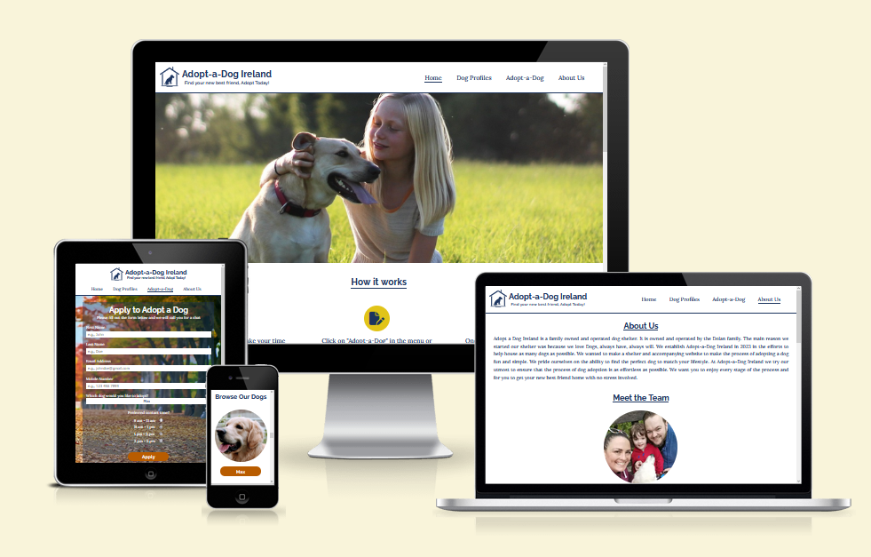

# Adopt-a-Dog Ireland
The Adopt-a-Dog Ireland website was designed to allows the user to Adopt-a-Dog from a dog shelter in Ireland.

[Adopt-a-Dog Ireland Website](https://garydolan.github.io/ci-p1-adopt-a-dog-ireland/)

# Table of Contents

Click to Expand

1. [Introduction](#adopt-a-dog-ireland)
2. [User Experience](#user-experience)
    * [Initial Discussion](#initial-discussion)
    * [User stories](#user-stories)
3. [Design](#design)
    * [Colour scheme](#colour-scheme)
    * [Typography](#typography)
    * [Icon creation](#icon-creation)
    * [Imagery](#imagery)
    * [Wireframes](#wireframes)
4. [Features](#features)
    * [Future implementations](#future-implementations)
    * [Accessibility](#accessibility)
5. [Technologies used](#technologies-used)
    * [Languages](#languages)
    * [Version control](#version-control)
    * [Programs](#programs)
    * [Tools](#tools)
6. [Deployment & Local Deployment](#deployment--local-deployment)
    * [Deployment](#deployment)
    * [Local Deployment](#local-deployment)
        * [How to Fork](#how-to-fork)
        * [How to Clone](#how-to-clone)
7. [Testing](#testing)
    * [Automated testing](#automated-testing)
    * [Manual testiing](#manual-testiing)
    * [Bugs](#bugs)
8. [Design & Development issues](#design--development-issues)
    * [Index page](#index-page)
    * [Dog profile page](#dog-profile-page)
    * [About us page](#about-us-page)
9. [Credits](#credits)
    * [Copy](#copy)
    * [Acknowledgements](#acknowledgements)

# User Experience

## Initial Discussion
Adopt-a-Dog Ireland is a website that I (Gary Dolan) developed for my first project as part of Code Institutes Diploma in Full Stack Software Development. The websites target audience is people interested in adopting a dog in Ireland. It was designed to allow prospective dog adopters to browser a catalogue of adoptable dogs. The website will provide the user with all the adoptable dogs details and also guide the user through the adoption process. It will allow the user to apply to adopt a dog of their choice.

## User stories

### Owner / Client goals
* To ensure the user can easily and intuitively use and navigate the website.
* To create a website that encourages first time learning, keeping consistant navigation, coloring and imagery site wide.
* To create a website that promotes feelings of positivity and trust in the user, using coloring, imagery and light hearted and informal text.
* To allow users to browse a catalogue of dogs available for adoption at the shelter. 
* To ensure the processes & steps involved in dog adoption are conveyed clearly to the user.
* To make it easy and straightforward for the user to apply to adopt a dog.
* To create a website which is viewable on a large array of devices.
* To instill a sense of family values in the website to bolster a high level of trust and comfort in the user. 
* To make it easy for the user to find and contact the shelter. 
* To create a high level of user feedback on the website, ensuring the user knows where they can and when the have interacted with the website.
* To create a website with a high level of accessibility so that all users regardless of capacity can access and use our services. 
* To create brand awareness via the website and social networks to drive business to the shelter.
* To use our increased awareness to generate add revenue. 
* To eventually partner with companies that sell products targeted at dogs. Initially targeting companies like "Big Gain" dog food,  "Chuckit" dog toys, "Halti" dog harnesses, "Hunter" dog beds, "Kong" dog toys and "Soopa" dog treats. 

### First time visitor goals
* I want to view dogs that are available for adoption.
* I want to get a feel for the dogs personalities and know their details.
* I want to understand how to adopt a dog.
* I want to apply to adopt a chosen dog directly from the website.
* I want to be able to learn about the shelter and have access to their social networks.

### Returning visitor goals 
* I want to view dogs that are available for adoption.
* I want to get a feel for the dogs personalities and know their details.
* I want to apply to adopt a dog directly from the website.
* I want to be able to find the shelter contact details and location. 
* I want to access the shelters social networks.

# Design
## Colour scheme
## Typography
## Icon creation
## Imagery
## Wireframes

# Features
## Future implementations
## Accessibility

# Technologies used
## Languages
## Version control
## Programs
## Tools

# Deployment & Local Deployment
## Deployment
## Local Deployment
### How to Fork
### How to Clone

# Testing
## Automated testing
## Manual testiing
## Bugs

# Design & Development issues
## Index page
## Dog profile page
## About us page

# Credits
## Copy
## Acknowledgements

